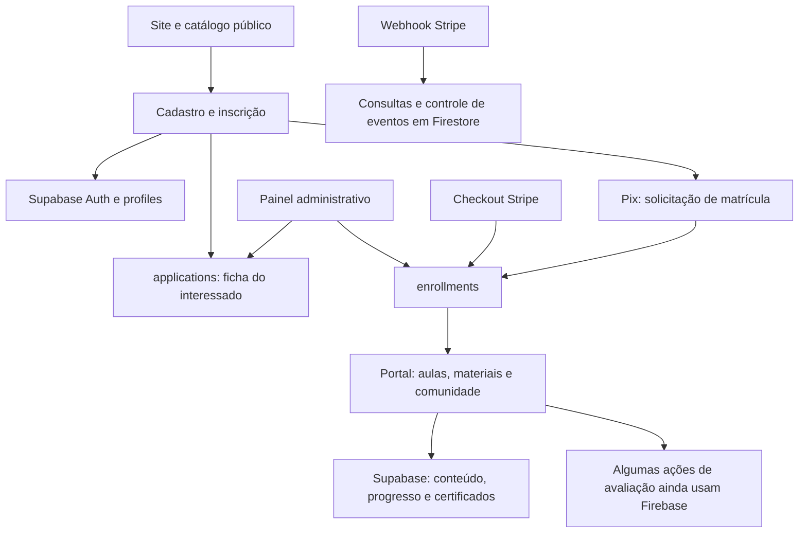
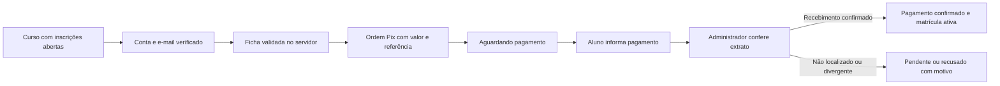

# Auditoria técnica e plano de lançamento — Instituto Figura Viva

> **Atualização da mesma data:** a segunda opinião foi confrontada e duas builds isoladas (completa e sem os 205 candidatos) passaram com WASM/fixtures. A retirada causou 14 novas falhas de suítes Jest. A confirmação de credenciais no histórico e a revisão de RPCs/Storage alteram a ordem de prioridade. Consulte o [plano revisado](<C:/Users/aless/Downloads/Sitefiguraviva/docs/audits/2026-10-03-plano-implementacao-revisado.md>) e a [comparação detalhada](<C:/Users/aless/Downloads/Sitefiguraviva/docs/audits/2026-10-03-comparacao-build.md>). Os impedimentos SWC registrados abaixo descrevem a primeira tentativa e não são o resultado final do experimento.

**Data:** 03/10/2026. **Prioridade definida pelo responsável:** site institucional e inscrições em cursos/pós-graduação; pagamento inicial por **Pix com conferência manual pelo administrador**; plataforma EAD em etapa posterior.

## 1. Parecer executivo

O projeto é um site institucional com catálogo de formações, conteúdo editorial, recursos de awareness, cadastro de usuários, inscrição, matrícula, painel administrativo e uma plataforma de aprendizagem em desenvolvimento. Há uma base considerável de implementação. Entretanto, **a existência das telas não comprova que os processos estejam concluídos**.

**Parecer: não ampliar a operação de inscrições e pagamentos antes de corrigir os bloqueadores abaixo e validar o percurso completo em homologação.** O site público já responde e apresenta dois cursos; isso não valida o cadastro, a persistência da inscrição, a conferência do Pix nem a liberação correta de acesso.

Os principais bloqueadores são:

1. Cadastro confirma e-mail sem comprovar sua posse, enquanto a autorização concede privilégios administrativos por endereço de e-mail. A combinação permite escalada **se um endereço autorizado ainda não tiver conta**.
2. Os índices únicos parciais das migrações não correspondem aos `onConflict` utilizados em matrículas e progresso. Um banco criado apenas a partir dessas migrações tende a rejeitar essas operações. O esquema real de produção precisa ser comparado.
3. A tabela de interessados tem RLS habilitada, mas não há políticas para ela nas migrações examinadas. O painel tenta operá-la diretamente pelo navegador.
4. O fluxo Pix apresenta “Pagamento confirmado!” para uma matrícula que apenas aguarda aprovação; não conserva uma ordem de pagamento recuperável nem registra a declaração de pagamento.
5. Há três caminhos divergentes de aprovação; o utilizado em `/admin/approvals` libera acesso sem registrar pagamento, responsável e conferência.
6. A publicação comercial de curso exige conteúdo EAD publicado, contrariando a estratégia de lançar inscrições primeiro.
7. Recuperação de senha, conversão de interessado em aluno e validação do build/testes ainda têm pendências concretas.

**Estratégia recomendada:** concluir uma operação pequena e coerente em Supabase — catálogo, conta, inscrição, ordem Pix e conferência administrativa — antes de terminar avaliações, progresso e certificados. Stripe pode ficar desativado na primeira versão, preservando o código até uma revisão própria. EAD e recursos complementares não devem atrasar a correção da autenticação ou da matrícula.

## 2. Escopo, método e limites das conclusões

### 2.1 Base examinada

- Workspace: `C:/Users/aless/Downloads/Sitefiguraviva`.
- [Repositório GitHub](https://github.com/rsangijipa/Sitefiguraviva), `main`: `6f29970766eeccad643680d07422bc33ec8a7b31`, commit de 15/09/2026. O HEAD local coincide com o remoto consultado.
- **Mais de 100 alterações locais preexistentes**, incluindo arquivos novos e exclusões. O relatório analisa o estado local disponível; partes dele diferem do último commit. Não é possível presumir que esse estado esteja publicado.
- [Site publicado](https://www.institutofiguraviva.com.br/), verificado por navegação anônima com Edge/Playwright.
- Supabase informado: projeto `jdxorryvmcvtqsddkpdm`. O dashboard exige autenticação; **o banco, as políticas aplicadas, os buckets e os serviços efetivamente ativos não foram inspecionados remotamente**. Não foi identificado um endereço de homologação separado.

Foi feito inventário de arquivos e rotas, grafo de imports locais, comparação de conteúdo duplicado, leitura aprofundada dos caminhos de negócio, revisão das 31 migrações, configurações, CI e dependências. A leitura de código concentrou-se nos fluxos críticos; isto não é uma prova formal de cada linha de todos os arquivos. Não foram criadas contas, feitas inscrições, executados pagamentos nem alterados dados no ambiente publicado. Arquivos da aplicação e alterações locais foram preservados.

### 2.2 Como interpretar a evidência

| Marca | Significado |
|---|---|
| Código | Comportamento ou incompatibilidade identificado nos arquivos locais. Pode diferir do deploy. |
| Reprodução isolada | Trecho real executado com serviços simulados, sem conexão nem gravação real. Demonstra o comportamento local, não uma exploração em produção. |
| Produção pública | Observação direta de navegação anônima no domínio informado. |
| Esquema a confirmar | Migrações sustentam a conclusão, mas o banco implantado pode conter mudanças fora do Git. |
| Candidato | Indício estático de arquivo não utilizado; não autoriza exclusão. |

Prioridades: **P0** bloqueia inscrições/pagamentos ou exige correção imediata de autorização; **P1** necessário antes do lançamento da funcionalidade afetada; **P2** organização, desempenho, conteúdo ou melhoria. Uma pendência P1 de EAD pertence à etapa EAD, exceto quando expõe funções sensíveis no deploy atual.

## 3. O que o aplicativo é e como está organizado

### 3.1 Arquitetura atual

O frontend e grande parte do backend estão no mesmo aplicativo **Next.js App Router**. O backend aparece em `src/app/api`, Server Actions, serviços de domínio e repositórios; não existe uma API independente que concentre toda a regra de negócio.

Supabase já concentra identidade, perfis, conteúdo e matrícula. **A migração de Firebase está incompleta nos consumidores ativos**, especialmente avaliações e Stripe. Isso produz duas identidades, esquemas, nomes de campos e regras de autorização concorrentes. Há pastas por funcionalidade em `src/features`, mas ações também estão divididas entre `src/actions` e `src/app/actions`, com regras repetidas em `src/lib`.

### 3.2 Tecnologias

Next 15, React 19, TypeScript, Tailwind, Supabase Auth/Postgres/Storage, React Query, Firebase/Firebase Admin, Stripe, Sentry e Upstash. Recursos interativos também utilizam Three.js, React Three Fiber, partículas, áudio, Motion/Framer Motion e armazenamento local. PDFs utilizam bibliotecas distintas.

O Next efetivamente instalado no ensaio de build foi **15.5.25**; a faixa declarada é `^15.5.12`. Há `eslint-config-next` 16 com Next 15, tipos React 19.2 com runtime React 19.0, tipos Node 25 e CI em Node 18/20. São divergências de manutenção, não prova automática de falha. TypeScript não está declarado diretamente, embora o comando `tsc` dependa dele transitivamente.

### 3.3 Mapa do diretório

| Área | Finalidade e avaliação |
|---|---|
| `src/app` | Páginas públicas, autenticação, inscrição, portal, administrador, APIs e ações. Núcleo do produto. |
| `src/features` | Domínios de cursos, matrícula, progresso, certificados, conteúdo, recursos e comunidade. Bom ponto de partida para consolidar as regras. |
| `src/components`, `src/hooks`, `src/context` | Interface e estado. Misturam componentes atuais, antigos, protótipos e aliases. |
| `src/lib`, `src/data`, `src/services`, `src/infrastructure` | Integrações, sessão, consultas e utilidades. Há múltiplas portas para o mesmo domínio. |
| `supabase/migrations` | 31 migrações: esquema, RLS, Storage e recursos. Devem ser a fonte versionada do banco. |
| `public` | 86 arquivos, aproximadamente 41,4 MB decimais; imagens, áudio, documentos e artefatos públicos. |
| `e2e`, `tests`, testes junto ao código | Cobertura existente de jornadas, segurança, arquitetura, acessibilidade e orçamento de desempenho; execução integral pendente. |
| `scripts`, `tools`, `src/scripts` | Auditoria, seed, migração e manutenção. Parte das ferramentas novas não está versionada. |
| `docs` | Arquitetura, auditorias e planos históricos. Algumas descrições já divergem do código; não tratar todos os documentos como instruções atuais. |
| `.github`, `.husky` | CI, governança e hooks. Precisam acompanhar a arquitetura Supabase. |
| `.next`, `node_modules`, relatórios de testes | Artefatos gerados. Afetam espaço e buscas locais; não são código de produto a reorganizar manualmente. |
| `.worktrees` | Contém snapshot com dependências e uma entrada Git especial; exige tratamento específico antes de limpeza. |

## 4. Configurações de agentes e ferramentas

Não foi encontrado `AGENTS.md`, `CLAUDE.md` ou `SKILL.md` aplicável no projeto/árvore de código examinada, excluindo dependências e snapshots, nem nos diretórios ancestrais verificados. Isso não exclui instruções globais no ambiente do desenvolvedor ou dentro de pacotes externos.

- [.claude/launch.json](C:/Users/aless/Downloads/Sitefiguraviva/.claude/launch.json): configuração para iniciar `npm run dev` na porta 3000; não é uma regra de arquitetura.
- [.kiro/settings/cli.json](C:/Users/aless/Downloads/Sitefiguraviva/.kiro/settings/cli.json): configura descoberta de ferramentas; não descreve convenções do aplicativo.
- `.superpowers/sdd` contém 13 registros/briefings históricos. `docs/superpowers` também contém planos e especificações; arquivar por data e assunto, preservando decisões relevantes.
- `.github/CODEOWNERS`, workflows e hooks são governança do desenvolvimento, não prova de qualidade ou completude.

Recomenda-se criar um `AGENTS.md` curto na raiz, com comandos **verificados**, fonte canônica Supabase, distinção entre service role e cliente, requisitos de autorização em ações, máquina de estados da matrícula, proibição de pagamentos/seeds no ambiente real e estratégia de testes. Não gerar um grande manual que apenas copie documentos antigos. Esta auditoria utilizou a skill [007](<C:/Users/aless/.agents/skills/007/SKILL.md>) para estruturar a análise de segurança; ela não foi instalada no repositório.

## 5. Cadastro, autenticação e autorização

### AUTH-01 — P0: e-mail sem verificação combinado com privilégio por e-mail

[signup.ts:110](<C:/Users/aless/Downloads/Sitefiguraviva/src/app/actions/signup.ts:110>) cria usuários com `email_confirm: true`. [authService.ts:3](<C:/Users/aless/Downloads/Sitefiguraviva/src/lib/auth/authService.ts:3>) tem lista administrativa embutida e aceita listas por ambiente. [supabase-session.ts:48](<C:/Users/aless/Downloads/Sitefiguraviva/src/lib/auth/supabase-session.ts:48>) reconhece administrador pelo e-mail, mesmo quando o perfil tem papel `student`.

A reprodução isolada criou um cadastro com e-mail autorizado e obteve `admin: true`, sem entrega/confirmação de mensagem. **A pré-condição é haver um endereço administrativo permitido ainda livre no Auth**; a unicidade de uma conta já existente impede esse cadastro específico. Não foi tentada exploração no site publicado.

**Correção:** privilégios exclusivamente pelo perfil/identidade verificada; provisionamento administrativo explícito, sem promoção automática no login. Cadastro público deve confirmar posse do e-mail antes de acesso sensível. Revogar privilégios precisa continuar efetivo após novo login; hoje a sincronização pode promovê-los novamente. Revisar a lista e as contas existentes sem publicar endereços ou chaves.

### AUTH-02 — P1: desativação de aluno não é uma barreira uniforme

[server.ts:58](<C:/Users/aless/Downloads/Sitefiguraviva/src/lib/auth/server.ts:58>) exige uma sessão, mas não rejeita `isActive: false`. A geração/solicitação Pix também verifica apenas existência de sessão. A função SQL de acesso ao curso aceita matrícula ativa sem verificar o perfil ativo. O bloqueio administrativo tenta banir no Auth, porém ignora erros retornados como objeto; não é garantia suficiente para tokens já válidos.

A reprodução isolada confirmou que `requireSession` devolve perfil desativado. Centralizar a exigência de perfil ativo no servidor e na autorização SQL, além de revogar sessões quando necessário. Testar aluno desativado em todas as rotas e ações, não apenas no menu.

### AUTH-03 — P1: helpers privilegiados marcados como Server Actions

[user-service.ts:18](<C:/Users/aless/Downloads/Sitefiguraviva/src/lib/auth/user-service.ts:18>) aceita objeto com `uid`/`email` e escreve perfil por service role, sem comprovar a identidade dentro da função. A execução isolada aceitou identidade fornecida e promoveu perfil. [enrollment-service.ts:47](<C:/Users/aless/Downloads/Sitefiguraviva/src/lib/auth/enrollment-service.ts:47>) também exporta helper de escrita privilegiada em arquivo `"use server"` sem autorização própria.

**A exposição HTTP desses helpers no deploy não foi demonstrada**: depende de quais exports chegam ao manifest compilado. A correção de arquitetura continua necessária: helpers internos com `import "server-only"`; ações públicas pequenas que autenticam, autorizam e validam parâmetros antes da chamada. A [documentação do Next](https://nextjs.org/docs/app/api-reference/directives/use-server) exige autenticação e autorização para operações sensíveis em funções do servidor.

### AUTH-04 — P1: login, recuperação de senha e sincronização incompletos

Em [auth/page.tsx](<C:/Users/aless/Downloads/Sitefiguraviva/src/app/auth/page.tsx>), chamadas de login aguardam `signIn`, mas não tratam seu resultado `{ error }` antes da sincronização. O mapeamento de erros ainda usa códigos Firebase. A ação de sincronização também pode preferir uma sessão antiga a um novo token fornecido, se houver cookie anterior.

Foi localizado envio de recuperação no contexto de autenticação, mas **não uma tela/handler que conclua a recuperação com `auth.updateUser({ password })`**. Isso afeta tanto “esqueci a senha” quanto contas criadas manualmente sem senha. Corrigir erro do login antes de navegar, substituir a sessão de forma consistente e implementar o percurso completo de recuperação, incluindo token inválido/expirado e URLs autorizadas no Supabase. Não basta gerar um link.

Pontos positivos: consulta de usuário/token no servidor, cookie de sessão, guardas administrativas, validação e rate limit em parte das APIs. Esses controles precisam ser usados por todos os caminhos, inclusive os alternativos.

## 6. Inscrição e Pix manual — núcleo do primeiro lançamento

### DATA-01 — P0, esquema a confirmar: upsert incompatível com índices

[enrollment-service.ts:100](<C:/Users/aless/Downloads/Sitefiguraviva/src/lib/auth/enrollment-service.ts:100>) usa `onConflict: "user_id,course_id"`. [recordLessonProgress.server.ts:80](<C:/Users/aless/Downloads/Sitefiguraviva/src/features/progress/application/recordLessonProgress.server.ts:80>) usa `user_id,course_id,lesson_id`. Na [migração inicial:187](<C:/Users/aless/Downloads/Sitefiguraviva/supabase/migrations/202606110001_p2_lms_foundation.sql:187>), os índices correspondentes são **parciais**, com `WHERE user_id IS NOT NULL`; não foi encontrada migração posterior com a restrição única não parcial equivalente.

Sem predicado na inferência de conflito, um banco com esse esquema pode responder **42P10**, impedindo matrícula e progresso. A regra de inferência está na [documentação PostgreSQL de INSERT](https://www.postgresql.org/docs/current/sql-insert.html). A conclusão vem do contrato código/migrações, não de execução contra o banco real.

Comparar os índices aplicados; corrigir por migração versionada, verificando duplicidades antes. Alternativas: unicidade não parcial compatível com esses upserts ou RPC com conflito/predicado apropriados. Preservar compatibilidade com linhas legadas cujo `user_id` é nulo.

### DATA-02 — P0, esquema a confirmar: interessados sem políticas RLS

A [migração applications](<C:/Users/aless/Downloads/Sitefiguraviva/supabase/migrations/202609060002_applications.sql:21>) habilita RLS, mas nenhuma das 31 migrações define políticas dessa tabela. A API de inscrição escreve por service role; [applications/page.tsx:48](<C:/Users/aless/Downloads/Sitefiguraviva/src/app/admin/(protected)/applications/page.tsx:48>) lê, altera e exclui pelo cliente do navegador.

Em banco derivado apenas dessas migrações, o aluno consegue enviar pela API, mas o administrador não consegue operar os registros pelo caminho usado na tela. Se produção recebeu políticas manuais, elas precisam ser verificadas e versionadas. Preferir ações administrativas autenticadas ou políticas específicas de administrador, sem abrir leitura geral das respostas dos alunos.

### ENR-01 — P0: estado Pix não representa o que aconteceu

Em [EnrollmentStepper.tsx:48](<C:/Users/aless/Downloads/Sitefiguraviva/src/app/inscricao/[courseId]/EnrollmentStepper.tsx:48>), `pending_approval` leva à última etapa. A matrícula pendente é criada **antes** da geração do QR. Se a chave estiver ausente, ocorrer erro ou o aluno recarregar a página, o fluxo pode cair na última etapa sem recuperar QR/instruções. O botão “Já realizei o pagamento” muda a etapa e atualiza a rota; não grava uma declaração nem referência de pagamento.

Em [EnrollmentStepper.tsx:484](<C:/Users/aless/Downloads/Sitefiguraviva/src/app/inscricao/[courseId]/EnrollmentStepper.tsx:484>), a interface anuncia **“Pagamento confirmado!”** enquanto a matrícula está apenas pendente. Isso comunica uma confirmação que não existe. Usar textos e estados distintos: aguardando pagamento, pagamento informado/aguardando conferência, aprovado e recusado. A ordem Pix deve poder ser retomada após recarregar ou entrar em outro dispositivo.

### ENR-02 — P0: liberação de acesso sem conferência financeira registrada

Há caminhos diferentes:

| Caminho | Comportamento local |
|---|---|
| [/admin/approvals actions:46](<C:/Users/aless/Downloads/Sitefiguraviva/src/app/admin/(protected)/approvals/actions.ts:46>) | Atualiza `status: active`; não persiste `payment_status`, `paid_at`, aprovador, data da conferência ou audit trail. Rejeição exige motivo, mas não o grava. |
| [admin/enrollment.ts:179](<C:/Users/aless/Downloads/Sitefiguraviva/src/app/actions/admin/enrollment.ts:179>) | Ativa primeiro, registra aprovador em chamada separada e ignora erro dessa atualização; não confirma pagamento. |
| [enrollment-pix.ts:112](<C:/Users/aless/Downloads/Sitefiguraviva/src/app/actions/enrollment-pix.ts:112>) | Tem campos de aprovação, `paidAt` e auditoria, mas não foi encontrado consumidor no painel atual; não define `paymentStatus: paid`. |

Concentrar a conferência manual numa operação **atômica e idempotente**, com estado anterior permitido, pagamento pendente, valor/referência, data, responsável e log. Aprovar duas vezes não deve duplicar ou sobrescrever evidências. Rejeitar deve guardar motivo. Não listar todo `pending_approval` como “pagamentos realizados”: solicitar QR não equivale a pagar.

### ENR-03 — P1: referência Pix, valor e Copia e Cola incompletos

[generatePixPayload:98](<C:/Users/aless/Downloads/Sitefiguraviva/src/app/actions/enrollment-pix.ts:98>) gera TXID com `${uid}${courseId}` cortado em 25 caracteres. O UUID Supabase ocupa o início inteiro; o curso é descartado. A reprodução mostrou payload idêntico para dois cursos do mesmo aluno. Além disso, a função não lê preço do curso nem inclui valor na cobrança.

Pix sem valor pode ser uma opção operacional legítima, mas exige mostrar claramente o valor devido e conferir valor recebido. Hoje esse contrato não está implementado. A UI anuncia “Copia e Cola”, porém conserva apenas a imagem do QR e não oferece o código copiável. Usar referência por **ordem de pagamento**, compatível com o formato aceito pelo PSP, valor obtido no servidor e exibido em reais, favorecido, instruções e código com botão de copiar. Não usar preço enviado pelo navegador como autoridade.

### ENR-04 — P1: validação e consentimento não garantem ficha completa

[applications/submit/route.ts:17](<C:/Users/aless/Downloads/Sitefiguraviva/src/app/api/applications/submit/route.ts:17>) limita tamanho e frequência — positivo — mas aceita respostas vazias e consentimento opcional. Não exige os campos específicos da ficha nem valida disponibilidade de inscrição no curso. O upsert redefine o estado para `submitted`, mesmo quando já existia contato ou matrícula. JSON inválido cai em erro 500 em vez de 400.

O formulário envia `lgpd: true` automaticamente, com timestamp do cliente, sem um aceite correspondente à ficha. Deve haver registro fiel do que foi apresentado/aceito, versão do aviso e data do servidor, conforme a base legal definida pelo responsável. Isto é uma observação técnica, não um parecer jurídico de conformidade.

`createEnrollmentPending` também não exige ficha submetida, perfil ativo ou curso aberto, nem aplica validação/rate limit próprios. Regras devem ser impostas no servidor, pois a sequência visual pode ser contornada. Definir claramente se a ficha é requisito ou apenas cadastro de interesse.

### ENR-05 — P1: conversão de interessado em aluno usa e-mail ausente

O painel obtém e-mail de `answers.email`, mas o formulário atual não envia esse campo. [adminEnrollment.ts:53](<C:/Users/aless/Downloads/Sitefiguraviva/src/actions/adminEnrollment.ts:53>) exige e-mail; portanto, a conversão falha para inscrições desse fluxo. A identidade deve vir de `application.user_id` associado a `profiles`, sem depender de campo livre fornecido pelo cliente.

Para um aluno novo criado manualmente, a ação retorna link de recuperação, mas a UI não o apresenta/encaminha; a recuperação também não está concluída (AUTH-04). Atualizar a lista local após conversão, manter telefone e nome em fontes coerentes e garantir que o aluno tenha um caminho efetivo de primeiro acesso. Não marcar `paid` automaticamente só por converter um interessado, sem decisão financeira explícita.

### 6.1 Fluxo mínimo recomendado

Estados sugeridos para a ordem: `awaiting_payment`, `under_review`, `paid`, `rejected`, `canceled`. Podem ser introduzidos numa entidade de pagamento sem reescrever precipitadamente o enum de matrícula. Separar **inscrição/interesse**, **pagamento** e **direito de acesso**. Uma matrícula manual gratuita pode ter motivo próprio; não precisa falsificar recebimento Pix.

Dados mínimos: aluno, curso, valor em centavos/BRL, referência única, estado, datas, responsável pela conferência e motivo. Upload de comprovante é opcional conforme a operação escolhida; se existir, deve ser privado e não deve ser tratado como confirmação bancária automática. Conferência por extrato e contato externo pode funcionar, desde que a decisão seja registrada no sistema.

## 7. Site, catálogo e frontend

### SITE-01 — P1: inscrição comercial depende de EAD pronto

[admin-publishing.ts:24](<C:/Users/aless/Downloads/Sitefiguraviva/src/app/actions/admin-publishing.ts:24>) exige módulo publicado, aula publicada e blocos antes de abrir/publicar curso. Isso impede cadastrar uma formação para venda enquanto suas aulas EAD ainda estão sendo preparadas.

Separar visibilidade pública, abertura/fechamento de inscrições e liberação pedagógica. Para site/inscrição, validar título, oferta, público-alvo, modalidade, datas, carga horária, preço, responsável e termos. Para EAD, validar currículo e acesso em outra transição.

### SITE-02 — P1: campos comerciais apresentados não são salvos

[CourseCreateClient.tsx:78](<C:/Users/aless/Downloads/Sitefiguraviva/src/app/admin/(protected)/courses/new/CourseCreateClient.tsx:78>) não inclui no payload preço e parcelas mantidos no formulário; também há campo de vídeo introdutório sem persistência equivalente. A interface dá a impressão de configurar esses dados, mas o fluxo de cobrança não os recebe.

Definir um modelo comercial canônico com dinheiro em centavos, moeda, tipo de oferta, datas e modalidade, e testar criar → editar → recarregar → exibir → gerar Pix. A página de detalhe também apresenta modalidade padronizada como online/Zoom, que deve refletir o curso real. Para pós-graduação, confirmar conteúdo comercial específico, critérios de ingresso e documentação; não foi encontrado um fluxo independente completo dessa categoria.

### SITE-03 — P1: estados públicos e internos têm contratos diferentes

[supabaseContentRepository.ts:170](<C:/Users/aless/Downloads/Sitefiguraviva/src/features/content/infrastructure/supabaseContentRepository.ts:170>) filtra cursos por publicado **e** aberto. [data/courses.ts](<C:/Users/aless/Downloads/Sitefiguraviva/src/data/courses.ts>) busca um curso percorrendo a listagem pública inteira. Ao fechar inscrições, o detalhe/retorno da inscrição pode deixar de encontrar o curso, embora um aluno matriculado deva manter acesso. Cadastro exige apenas publicado; checkout tem outro critério.

Criar consultas distintas para detalhe público, inscrições abertas e conteúdo de aluno. Buscar por ID/slug no banco, evitando carregar catálogo completo para cada detalhe. O servidor deve escolher explicitamente o cliente de banco apropriado, em vez de reutilizar uma instância orientada ao navegador.

### SITE-04 — P2: dados resumidos contaminam caches de listas completas

[page.tsx:52](<C:/Users/aless/Downloads/Sitefiguraviva/src/app/page.tsx:52>) carrega apenas três cursos/posts. [useContent.ts:28](<C:/Users/aless/Downloads/Sitefiguraviva/src/hooks/useContent.ts:28>) usa as mesmas chaves de cache da listagem completa, com dados iniciais considerados frescos por cinco minutos. Ao navegar a partir da home, a listagem pode aproveitar apenas esses três itens.

Os posts da home usam `data.image`, enquanto o repositório mapeia `image_url`, e omitem tipo/conteúdo/URL de PDF usados pelos modais. A galeria recebe `[]` como dado inicial e `refetchOnMount: false`, podendo permanecer vazia por dez minutos. Corrigir DTOs e chaves separadas para resumo/lista/detalhe; não usar array vazio como equivalente de consulta concluída. Verificar também erros `{ error }` das consultas da home, atualmente ignorados em parte.

### SITE-05 — P2: SEO, contato e landmarks confirmados no site publicado

As páginas consultadas têm canonical apontando para `https://figuraviva.com.br`, enquanto o domínio informado é `https://www.institutofiguraviva.com.br`. O código confirma base fixa em [layout.tsx:33](<C:/Users/aless/Downloads/Sitefiguraviva/src/app/layout.tsx:33>), sitemap e robots. Se não existe estratégia deliberada de domínio canônico/redirecionamentos, isso envia sinais conflitantes aos buscadores. Definir uma URL pública única por ambiente e verificar redirecionamentos.

`/contato` retornou **404**; há referência de fallback para contato no código. Implementar a página ou apontar os links para o canal real. Na home publicada foram encontrados dois `<main>` e dois IDs `main-content`; privacidade e termos também têm dois `<main>`. Ajustar a composição entre layout e página, testar teclado, foco de modais, contraste, leitores de tela e viewport móvel. Esta verificação não certifica conformidade integral de acessibilidade.

### SITE-06 — P2: conteúdo comercial inconsistente em produção

Na inscrição da “III Formação Clínica em Gestalt-Terapia”, o texto menciona **400 horas**, mas o campo de duração mostra **40h**. O início apresentado é 25–26/04/2026, anterior à data desta auditoria; pode ser uma turma em andamento, mas é necessário esclarecer se as inscrições atuais ainda são válidas. Esses pontos foram observados na página pública, sem alteração de registros.

## 8. Painel administrativo: completude das funcionalidades

**Nenhum módulo pode ser declarado 100% concluído só pela leitura de código.** A tabela distingue implementação presente e pendência concreta; CRUD “presente” significa tela e caminho de persistência identificados, ainda sem teste autenticado no banco real.

| Área/rota | Situação | O que existe / o que falta |
|---|---|---|
| Visão geral `/admin`, `/admin/dashboard` | Parcial | Estatísticas e navegação; agregados ainda têm fallbacks Firebase em serviços. Validar zeros, fontes, períodos e falha de consulta. |
| Usuários `/admin/users` | Parcial | Listagem Supabase, papéis, bloqueio, exclusão. Falta tratar erros Auth/DB e proteger último administrador/rebaixamento próprio. Exclusão/bloqueio da própria conta já têm proteção. Telefone na listagem é fixado em nulo. |
| Interessados `/admin/applications` | Bloqueado pelo contrato atual | Tela e alteração de status presentes; RLS ausente nas migrações, e-mail de campo ausente, onboarding e atualização local incompletos. |
| Alunos/matrículas `/admin/enrollments` | Parcial | Matrícula manual individual/lote, status, revogação. Dependem de DATA-01; ausência de transições financeiras coerentes e entrega efetiva de primeiro acesso. |
| Aprovações `/admin/approvals` | Parcial, bloqueador Pix | Lista e botões existem; liberação sem comprovada conferência e sem trilha completa. |
| Cursos `/admin/courses` | Parcial | Criação, edição, módulos, aulas, builder, materiais e configurações. Preço/parcelas, publicação comercial, estados e permissões requerem correção. |
| Avisos/comunidade/alunos nas abas do curso | Presente, validação pendente | Componentes e repositórios existentes. Validar turma correta, autorização, visibilidade e atualização das listas. |
| Avaliações `/admin/assessments` | Parcial, EAD | Leitura Supabase com fallbacks; criação/edição e consumidores ainda dependem de Firebase. Obrigatoriedade pode voltar como falsa no mapeamento. |
| Correções `/admin/assessments/submissions` | Parcial, EAD | Lista e tela de correção; coleções/esquemas divergentes impedem garantir que a entrega do aluno chegue à lista. |
| Diário visual `/admin/blog` | CRUD presente | Publicação/edição identificadas. Testar texto, PDF, capa, rascunho, links e cache público. |
| Galeria `/admin/gallery` | CRUD presente | Lista, criação/edição e publicação. Verificar Storage, reordenação e sincronização com a home. |
| Documentos `/admin/public-docs` | CRUD presente | Persistência e publicação. Verificar arquivos, limites, validação e despublicação. |
| Estante `/admin/books` | CRUD presente | Criação/edição, capa e RPC de ordenação. Testar upload e apresentação pública. |
| Calendário `/admin/calendar` | Implementado, validar | Gestão de eventos identificada. Conferir fuso, início/fim, público e cancelamento. |
| Eventos ao vivo `/admin/events` | Parcial | Gestão e consumo no portal. Consulta de próximos eventos exclui evento que já começou; tratar a janela em andamento. |
| Gamificação `/admin/gamification` | Parcial, EAD | Ações canônicas Supabase, mas hook administrativo consulta Firestore. Tela pode não mostrar o ledger real. |
| Google Suite `/admin/google` | Configuração parcial | Salva IDs/URLs; não constitui integração OAuth/sincronização completa. Risco de sobrescrever documento `config` compartilhado (OPS-04). |
| Logs `/admin/logs` | Parcial | Supabase e trilha em algumas ações. Caminhos de aprovação sem log; ator `system` textual não cabe em FK UUID de alguns logs. |
| Utilidades `/admin/utilities` | Ferramentas internas | Operações de manutenção e exclusão de dados de teste. Restringir por ambiente, registrar execução e retirar da operação cotidiana de lançamento. |
| Configurações `/admin/settings` | Presente, validar | Instituto, fundadora, equipe, SEO, legal e configuração. Verificar persistência, publicação, campos compartilhados e invalidação do cache. |
| Analytics `/admin/analytics` | Parcial | Dashboard existente fora da navegação principal. Revisar fonte de dados, consentimento de medição e diferença entre evento e conversão real. |
| Acesso como aluno/impersonação | Indisponível por decisão explícita | Ação está desabilitada. Ocultar botão ou explicar indisponibilidade; não anunciar como recurso entregue. |

### OPS-01 — P1: erros retornados pelo Supabase são ignorados

[user-management.ts:98](<C:/Users/aless/Downloads/Sitefiguraviva/src/app/actions/user-management.ts:98>) e rollback do cadastro usam `.catch`, mas o SDK frequentemente resolve a Promise com `{ error }`. Assim, banimento/exclusão pode falhar sem interromper o processo. A exclusão pode remover perfil mesmo quando Auth não foi removido, e a tela receber sucesso.

Ler `error` em cada operação, separar ausência esperada de falha real, conferir linhas afetadas e usar transações/compensação onde duas alterações devem formar uma unidade. `updateUserRole` não protege rebaixamento próprio nem último administrador; reintrodução automática de admin por e-mail agrava o problema. Não tratar exclusão em cascata de matrícula/inscrição como uma operação de manutenção trivial.

### OPS-04 — P2: configuração compartilhada pode ser apagada

[google/page.tsx:56](<C:/Users/aless/Downloads/Sitefiguraviva/src/app/admin/(protected)/google/page.tsx:56>) faz upsert de `public_pages.key=config` com objeto local; o mesmo documento recebe configurações de outras telas. Ao descartar/recriar apenas campos Google, salvar pode substituir campos não presentes. Separar namespaces/documentos ou fazer atualização controlada que preserve os demais dados; validar versão para evitar perda em edições concorrentes.

## 9. Backend e pagamentos Stripe — etapa futura

### STR-01 — P1 antes de ativar Stripe: integração não está coerente com Supabase

Em [checkout-subscription/route.ts:51](<C:/Users/aless/Downloads/Sitefiguraviva/src/app/api/billing/checkout-subscription/route.ts:51>), checkout lê `legacy_payload.billing.priceIdMonthly`, enquanto o editor trabalha com campo canônico `stripe_price_id`. O endpoint é de assinatura/cartão; não cobre toda oferta de compra única/gratuita. Cria sessão Stripe antes da escrita de matrícula, sem chave de idempotência nem garantia de matrícula já ativa, podendo gerar sessões duplicadas ou deixar uma sessão sem registro local em caso de falha.

[webhook/route.ts:49](<C:/Users/aless/Downloads/Sitefiguraviva/src/app/api/billing/webhook/route.ts:49>) valida assinatura — controle positivo —, porém mantém lock de eventos e buscas de matrícula em **Firestore**, enquanto a escrita atual de matrícula é Supabase. Eventos de fatura podem não encontrar o aluno novo e terminar como processados. O webhook envia chaves como `stripe.subscriptionId`, que o mapper atual não reconhece; a reprodução confirmou perda do subscription ID.

Há ainda leitura de `(invoice as any).subscription`, que depende da versão do evento Stripe. Em versões Basil esse vínculo passou para `parent.subscription_details.subscription`, conforme [changelog oficial Stripe](https://docs.stripe.com/changelog/basil/2025-03-31/adds-new-parent-field-to-invoicing-objects). Confirmar versão do webhook, não apenas do SDK. Expiração/acesso de assinatura não é propagado uniformemente. Locks `processing` não têm recuperação confiável após interrupção; ordem de eventos e reconciliação precisam ser definidas.

[customer-portal/route.ts:19](<C:/Users/aless/Downloads/Sitefiguraviva/src/app/api/billing/customer-portal/route.ts:19>) exige `profiles.stripe_customer_id`, mas não foi localizado caminho atual que grave esse vínculo no checkout. Portanto, não declarar portal de cobrança concluído.

Para o lançamento Pix: retirar ofertas/links Stripe da experiência inicial ou aplicar feature flag no servidor aos endpoints ainda não operacionais. **Não basta ocultar o botão para proteger uma API.** Preservar integração para etapa posterior, com eventos em Supabase, idempotência, reconciliação, falha/reembolso/cancelamento e testes de assinatura/duplicação fora da produção.

## 10. EAD e portal do aluno — entregar por último

O portal tem dashboard, cursos, aulas, vídeo, material, progresso, avaliações, certificados, eventos, comunidade, perfil e recursos. O guard de rota redireciona visitante sem sessão, conforme verificado em produção. Isso não comprova a autorização de cada ação nem que uma matrícula paga percorra tudo sem falhas.

### EAD-01 — P1 de segurança: leitura de aula sem gate próprio

[lms.ts:8](<C:/Users/aless/Downloads/Sitefiguraviva/src/app/actions/lms.ts:8>) chama [courseService.ts:86](<C:/Users/aless/Downloads/Sitefiguraviva/src/lib/courseService.ts:86>), que busca conteúdo administrativo sem checar sessão, matrícula ou publicação nessa operação. Reprodução isolada devolveu aula não publicada e blocos privados sem identidade. **A exploração HTTP do deploy não foi testada**; verificar manifest/consumidores e corrigir a ação antes de expor o recurso.

Também revisar RLS de aulas/módulos: a condição de matrícula permite leitura de linhas sem aplicar sempre filtro de publicação no ramo de aluno. Material em rascunho não deve se tornar acessível só porque o aluno tem matrícula. Definir separadamente preview público, aluno matriculado, tutor e administrador.

### EAD-02 — P1: avaliações ainda misturam identidade e armazenamento

O [LessonPage:143](<C:/Users/aless/Downloads/Sitefiguraviva/src/app/portal/course/[courseId]/lesson/[lessonId]/page.tsx:143>) lê avaliações/entregas Supabase, passa linhas `snake_case` para componente que espera modelo `camelCase`. [AssessmentPlayer.tsx:8](<C:/Users/aless/Downloads/Sitefiguraviva/src/components/assessment/AssessmentPlayer.tsx:8>) usa [app/actions/assessment.ts:19](<C:/Users/aless/Downloads/Sitefiguraviva/src/app/actions/assessment.ts:19>), que verifica cookie **Firebase** e grava coleção `submissions`; o cookie atual é Supabase e outros caminhos usam `assessmentSubmissions`/`assessment_submissions`.

Nas ações administrativas antigas ainda há escrita Firestore seguida de espelho Supabase cujo erro não é tratado. IDs automáticos Firestore não são UUIDs compatíveis com `assessment_submissions.id`. O início de tentativa antigo é consumido por componentes candidatos a legados; não assumir que todo esse caminho está ativo, mas as ações de criação/edição ainda exigem consolidação.

Definir um único contrato de prova, tentativa, resposta e correção, com UUIDs/identidade Supabase, autosave recuperável, limite de tentativas e correção autoritativa. Testar entrega → lista administrativa → correção → resultado → requisito de certificado.

### EAD-03 — P1 de integridade: gabarito e criação de nota

As perguntas incluem respostas corretas no JSON retornado ao cliente. Remover gabarito do DTO do aluno; não basta ocultá-lo na interface. A política RLS também precisa separar avaliação publicada de rascunho.

[202609040001:95](<C:/Users/aless/Downloads/Sitefiguraviva/supabase/migrations/202609040001_p0_rls_hardening.sql:95>) protege notas em **UPDATE**, mas a política de **INSERT** valida apenas aluno e acesso ao curso, sem exigir estado inicial sem nota/aprovação. Em banco derivado das migrações, um aluno matriculado pode inserir entrega própria já `graded`/`passed`, comprometendo o requisito de certificado. Não foi feita inserção real. Fechar INSERT e UPDATE, proteger vínculo prova/curso e deixar nota exclusivamente em operação autorizada do servidor.

### EAD-04 — P1: progresso e certificado têm regras concorrentes

[recordLessonProgress.server.ts](<C:/Users/aless/Downloads/Sitefiguraviva/src/features/progress/application/recordLessonProgress.server.ts>) faz leitura seguida de upsert para progresso monotônico; requisições concorrentes podem usar estado antigo. Calcula denominador por aulas publicadas sem aplicar o mesmo conjunto de módulos publicados usado no emissor de certificado. Atualiza matrícula para ativa/concluída sem preservar explicitamente todos os estados administrativos; recálculo/progresso concorrente com revogação deve ser protegido.

[supabaseCertificateIssuer.server.ts:18](<C:/Users/aless/Downloads/Sitefiguraviva/src/features/certificates/infrastructure/supabaseCertificateIssuer.server.ts:18>) valida matrícula e todas as aulas publicadas/provas obrigatórias — positivo —, mas não aplica todos os campos configuráveis de `certificateRules`, como habilitação/limiar. Usa nome da matrícula ou “Estudante”, sem recuperar nome canônico quando faltante. Verifica existência antes de inserir, sem restrição única usuário/curso nas migrações: emissões concorrentes podem duplicar certificado.

Centralizar currículo elegível, políticas de conclusão, expiração de acesso e emissão idempotente em transação. Confirmar a regra comercial sobre revisões de conteúdo para alunos já concluintes. A conclusão deve ser estável após publicação de novas aulas, se essa for a política adotada.

### EAD-05 — P2: recursos complementares e multimídia precisam de validação

- [portal/dashboard/route.ts:60](<C:/Users/aless/Downloads/Sitefiguraviva/src/app/api/portal/dashboard/route.ts:60>) ainda converte datas como Timestamp Firebase; strings Supabase perdem a data esperada.
- [supabaseEventRepository.server.ts:67](<C:/Users/aless/Downloads/Sitefiguraviva/src/features/events/infrastructure/supabaseEventRepository.server.ts:67>) seleciona início futuro, excluindo encontros em andamento.
- Há métodos antigos de subscription da comunidade que devolvem `[]`; existe hook realtime distinto. Testar o consumidor atual e remover stubs somente após mapear usos; não concluir que a comunidade inteira está vazia.
- A CSP de [next.config.mjs](<C:/Users/aless/Downloads/Sitefiguraviva/next.config.mjs>) não permite mídia Supabase em `media-src`, e a lista de frames não cobre provedores como Drive/Docs/Vimeo usados por algumas modalidades de embed. Ajustar pelo conjunto de provedores realmente autorizado e testar sem ampliar indiscriminadamente.
- Metas contém indicação de recurso futuro; suporte é contato, sem sistema completo de tickets. Impersonação está desabilitada; worker público identificado desregistra/recarrega, sem garantir experiência offline. Não anunciar esses recursos como prontos.

## 11. Organização, arquivos não utilizados e desempenho

### 11.1 Inventário verificável

O grafo analisou **1.069 arquivos JS/TS**, com **136 entradas de framework/runtime**; 787 foram alcançados desde essas entradas. Após excluir testes, declarações e scripts, sobraram **205 candidatos** a não utilizados. Foram encontradas **9 famílias de conteúdo exatamente duplicado**. Não houve import local literal não resolvido no grafo.

Esses números são de arquivos, não de funcionalidades. Imports calculados, CSS, plugins, uso externo/manual e detalhes do compilador podem escapar ao grafo. Testes ainda podem importar um candidato. **A lista não é uma autorização para apagar 205 arquivos.**

- [Lista completa dos 205 candidatos](<C:/Users/aless/Downloads/Sitefiguraviva/docs/audits/2026-10-03-evidence/unused-candidates.csv>).
- [Arquivos de conteúdo idêntico](<C:/Users/aless/Downloads/Sitefiguraviva/docs/audits/2026-10-03-evidence/duplicate-files.csv>).
- [Inventário, tamanhos, rotas e grafo](<C:/Users/aless/Downloads/Sitefiguraviva/docs/audits/2026-10-03-evidence/inventory.json>).

### 11.2 Onde revisar primeiro

| Grupo | Evidência e ação proposta |
|---|---|
| `src/components/resources/apps` | 109 candidatos, incluindo entradas `main.tsx` e componentes de protótipos. Comparar cada recurso com implementação atual em `features` e rota antes de retirar. |
| Componentes antigos da sala de pausa | 17 candidatos associados a implementações anteriores. Preservar recursos atuais e dados do usuário. |
| Árvores/efeitos antigos | `TreeVisualization`, `FeelingsTree`, `RainbowTree`, `FiguraVivaTree`, `ParticlesLayer`, `BackgroundEngine` aparecem entre candidatos. Comparar com `features/awareness-tree`. |
| Modais antigos de cursos e materiais | `CreateCourseModal`, `CourseEditorModal`, `MaterialsManager` e `QuizTaker` merecem revisão frente às páginas atuais. |
| Ações, aliases e repositórios legados | Há candidatos em `src/actions`, `lib` e infraestrutura. Verificar exposição como Server Action e consumidores antes de consolidar. |
| Conteúdo duplicado | Dados de emoções, serviços de áudio/Supabase e arquivos de árvore têm cópias byte a byte. Unificar contratos após comparar todos os consumidores. |
| `.tmp-tree-review` e `src/components/arvoredasemocoes` | Já aparecem como exclusões no workspace. Preservar a decisão local; não recriar nem atribuir essas remoções à auditoria. |

### ORG-01 — P2: `.worktrees` requer tratamento Git

`.worktrees/codex-care-tools` está no índice como **gitlink de modo 160000** para outro commit, com aproximadamente 379 MiB de conteúdo local. O `git worktree list` consultado não o apresenta como worktree registrada. É um resíduo especial, não apenas uma pasta descartável.

Antes de limpar, verificar mudanças úteis, metadados e necessidade do snapshot; corrigir a entrada Git e regras de ignore em uma alteração própria. Não executar remoção recursiva como primeira ação. O snapshot pode confundir buscas, inventário de dependências e reprodução do projeto.

### ORG-02 — P2: ignore impede versionar ferramentas necessárias

[.gitignore](<C:/Users/aless/Downloads/Sitefiguraviva/.gitignore>) ignora `/scripts/` inteiro. Arquivos antigos já rastreados permanecem, mas novos scripts utilizados em `package.json`, como auditoria da migração Firebase e migração de anexos de avaliação, ficam ignorados/não rastreados. Um clone limpo pode não conter esses comandos. Exceções pontuais de `.next` também não cobrem consistentemente todos os diretórios de build alternativo.

Versionar ferramentas operacionais necessárias e ignorar seus **resultados**, não toda a pasta. Corrigir regras para worktrees/cache e evitar snapshots de dependências no Git.

### 11.3 Limpeza de disco versus velocidade do usuário

| Pasta | Tamanho no inventário | Tratamento |
|---|---:|---|
| `.next` | 3,19 GiB | Cache/build regenerável. Limpar após parar processos e confirmar necessidade; não aumenta automaticamente a velocidade do site publicado. |
| `node_modules` | 1,04 GiB | Dependências instaladas. Reproduzir com `npm ci`; não editar arquivos de pacotes para corrigir aplicação. |
| `.worktrees` | 379 MiB | Snapshot com gitlink; preservar trabalho antes de decidir. |
| `src` | 6,36 MB decimais | Código e assets associados; consolidar por evidência. |
| `public` | 41,4 MB decimais | Assets. O impacto no usuário depende do que é solicitado em cada página. |

Excluir cache ajuda espaço, buscas e ferramentas locais. Excluir código já não alcançado pelo bundle pode melhorar manutenção sem alterar bytes transferidos. Não prometer aumento percentual de desempenho sem medição antes/depois.

### 11.4 Melhorias de desempenho com propósito

1. Corrigir consultas de detalhe que carregam catálogo inteiro, DTOs e chaves de cache (SITE-03/04). Reduzir `select('*')` onde o conteúdo completo não é necessário.
2. Separar carregamento do site de módulos EAD e recursos 3D/áudio. Manter lazy loading; medir se efeitos globais e prefetchs estão antecipando recursos pouco usados. Não remover uma biblioteca apenas porque é grande no disco.
3. Revisar imagens de capa e fontes: os PNGs de hero têm cerca de 1,5–2,35 MB cada; há áudios de 5,89 e 11,9 MB. Usar dimensões, formatos e carregamento adequados. O Next já transforma parte das imagens; medir o arquivo realmente transferido, não só o original.
4. Unificar Motion/Framer Motion, PDFs e QR somente após checar APIs e consumidores. Remover Firebase apenas depois de migrar consumidores ativos.
5. Medir mobile com cache frio, LCP/INP/CLS e bytes por rota em build de produção. A navegação desta auditoria foi um smoke test, **não Lighthouse nem amostra estatística de Core Web Vitals**.
6. Adotar TypeScript estrito gradualmente nas fronteiras de domínio. Hoje `strict: false`, `any` e `include` sem JS/JSX deixam inconsistências passar apesar de `checkJs: true`. Tipar DTOs e resultados de SDK primeiro; não fazer refatoração geral antes de resolver inscrição/Pix.

### 11.5 Organização alvo, incremental

Manter `src/app` para rotas/adapters e `src/features/<domínio>` para contrato, casos de uso e repositórios. Agrupar auth, courses/offers, applications, payments, enrollments e lms; clientes Supabase distintos de navegador/servidor. Toda regra de transição deve ter um único caso de uso. `components` contém interface compartilhada; `lib` contém utilidades reais. Arquivar documentação histórica por data. Evitar mover tudo de uma vez: corrigir contratos, redirecionar imports, validar, depois retirar duplicatas.

## 12. Segurança, operação e verificações executadas

### OPS-02 — P1: CI e recuperação ainda não demonstram lançamento reproduzível

[ci.yml](<C:/Users/aless/Downloads/Sitefiguraviva/.github/workflows/ci.yml>) executa lint, tipos, testes e build em Node 18/20, mas não fornece configuração Supabase explícita para build/ambiente local. Não concluir que secrets/configuração externa já suprem isso. Jornadas autenticadas podem ser puladas sem credenciais; job verde não prova fluxo financeiro. O workflow separado exige outro conjunto de secrets e roda principalmente testes `@smoke` em push/PR.

Há backup Firestore, mas não foi encontrada evidência equivalente de restauração Supabase/Postgres **e Storage**. Configurar versão Node suportada pelas dependências, ambiente de homologação, migrations aplicáveis a banco limpo e testes de RLS por papel. Validar backup e restauração reais, não apenas existência de workflow.

### OPS-03 — P1: alertas de dependências de produção

`npm audit --omit=dev --json` retornou **23 entradas de pacotes afetados: 9 altas, 12 moderadas e 2 baixas, zero críticas**. Isso não equivale a 23 falhas exploráveis independentes: advisories se propagam por dependências transitivas, e exposição depende do caminho de execução.

Entre os pacotes classificados como altos estão Firebase/Firebase Admin, Next, Sharp, PostCSS e transitivos de Firestore/gRPC. Os detalhes e URLs dos advisories estão em [npm-audit.json](<C:/Users/aless/Downloads/Sitefiguraviva/docs/audits/2026-10-03-evidence/npm-audit.json>). Fazer atualização controlada com lockfile, ler advisories e validar regressões; não aplicar `audit fix --force` como correção automática. Algumas melhorias dependem de concluir migração Firebase.

### 12.1 Resultados reais desta execução

| Verificação | Resultado e limite |
|---|---|
| `npm run typecheck` | **Passou**, exit 0. Configuração atual não é estrita; não valida regra de negócio. |
| `npm run lint` | **Passou**, exit 0. Não comprova runtime ou autorização. |
| `npm ls --depth=0 --json` | Exit 0; dependências principais instaladas consistentes com o ambiente. |
| `npm audit --omit=dev --json` | Consulta executada; exit 1 por vulnerabilidades reportadas. |
| Auditoria de migração Firebase | `migration-pending`. Há consumidores e referências restantes; contagem textual inclui comentários/legados. |
| `npm test -- --runInBand` | **Bloqueado antes das suítes**: controle de aplicação do Windows impediu carregar binário SWC. Não é resultado de testes funcionais reprovados. |
| `NEXT_DIST_DIR=.next-audit-20261003 npm run build` | **Não validado** pelo mesmo bloqueio SWC. Foi usado diretório separado; tentativa de fallback WASM não resolveu o ambiente. |
| Seis reproduções isoladas | Confirmaram promoção por e-mail, helper que confia em identidade fornecida, sessão desativada aceita, leitura de aula sem sessão, perda de subscription ID e colisão da referência Pix. Não são E2E. |
| Browser anônimo em produção | 12 rotas consultadas, sem erros de JavaScript capturados. Nenhum cadastro/pagamento/aprovação foi efetuado. |

Os logs e scripts estão em [2026-10-03-evidence](<C:/Users/aless/Downloads/Sitefiguraviva/docs/audits/2026-10-03-evidence>). `live-public-error.log` registra a primeira tentativa com Chromium ausente; a tentativa posterior com Edge concluiu e está em `live-public.json`. Build e Jest devem ser executados em ambiente compatível, por exemplo CI Linux configurada; não contornar a política de execução para declarar sucesso.

### 12.2 Navegação publicada

| Rota | Observação |
|---|---|
| `/`, `/formacoes`, `/auth`, `/privacidade`, `/termos` | Resposta 200. Home e páginas legais com landmarks duplicados; canonical de outro domínio. |
| `/curso/Ti8sjbPwhL9j7E9KLCHc` | Resposta 200, Formação Clínica, botão “Fazer Inscrição”. |
| `/curso/VtOJYjX6DXXMmoZHTIIL` | Resposta 200, Supervisão CO-VISAR, botão “Fazer Inscrição”. |
| `/inscricao/<cada um desses IDs>` | Resposta 200, etapa inicial de identificação. Inscrição completa não testada. |
| `/portal`, `/admin` | Navegação termina em `/auth?next=...`. O 200 final é do login; não significa acesso autorizado ao painel. |
| `/contato` | Resposta 404. |

### 12.3 Modelo de ameaças resumido

Ativos: identidade e papel, ficha de inscrição, recebimento/decisão Pix, direito de acesso, materiais privados, nota, certificado e dados pessoais. Fronteiras de confiança: navegador → ação/API; ação → service role; cliente → RLS; webhook → banco; conta manual → primeiro acesso.

| STRIDE | Risco localizado | Controle necessário |
|---|---|---|
| Identidade falsa / elevação | Cadastro sem posse de e-mail + promoção administrativa; helpers com identidade fornecida. | Verificação de e-mail, RBAC canônico, server-only e autorização por ação. |
| Alteração indevida | Aprovação divergente, inserção de nota/aprovação, transições de matrícula sem condição anterior. | Transações, RLS de INSERT/UPDATE, DTO sem gabarito, operações idempotentes. |
| Repúdio | Aprovação/rejeição sem trilha completa e logs com ator incompatível. | Auditoria persistida com responsável, data e motivo, sem expor dados sensíveis em logs. |
| Divulgação | Aula privada/rascunho sem gate consistente; permissões de respostas e arquivos. | Escopo por aluno/curso, publicação, URLs privadas/signed e testes negativos. |
| Indisponibilidade | Lock Stripe preso, build não reproduzido, recuperação/backup não demonstrados. | Retry controlado, reconciliação, CI e ensaio de restauração. |

A análise de impacto prioriza cadeia de negócio: identidade comprometida pode afetar aprovação e dados; matrícula/pagamento inconsistente impede lançamento; nota/certificado inconsistente impede EAD. Não foram feitos ataques em produção.

Para os oito domínios da metodologia de segurança: segredos/credenciais (20%) e conformidade (5%) não têm validação suficiente; autenticação/autorização (15%) e validação (15%) têm bloqueadores; proteção de dados (15%) exige confirmação de RLS/Storage; resiliência (10%) e monitoramento (10%) são parciais; supply chain (10%) tem alertas. **Não foi calculada nota global**, pois atribuir números a serviços e controles não inspecionados criaria falsa precisão. O parecer de lançamento decorre dos bloqueadores concretos, não de um score inventado. Não houve auditoria completa de segredos no histórico Git nem acesso a valores de chaves.

## 13. Plano de conclusão por etapas e critérios de aceite

### Etapa 0 — base segura e reproduzível

Resolver AUTH-01/02/03, DATA-01/02 e OPS-01/02/03 nos caminhos de lançamento. Fixar versão Node/configurações e fazer build/testes em ambiente compatível. Criar homologação separada, documentar variáveis **sem valores secretos**, comparar migrations e confirmar backups/restauração.

**Aceite:** clone limpo contém os comandos necessários; banco novo recebe migrações; build passa; visitante/aluno não acessa função administrativa; administrador só nasce por operação autorizada; aluno bloqueado não usa ações nem lê material; matrícula não falha por conflito; painel vê apenas dados permitidos.

### Etapa 1 — site e ofertas

Resolver SITE-01/02/03 e conteúdo público SITE-05/06; corrigir cache SITE-04. Publicar formação sem currículo EAD pronto. Revisar modalidade, carga horária, calendário, valor, condições de inscrição, página de contato e URLs públicas. Tratar requisitos específicos de pós-graduação no conteúdo e ficha, se for oferta distinta.

**Aceite:** curso pode ser criado, editado, publicado e fechado sem perder detalhe; inscrição fechada é recusada no servidor; preço/carga/data persistem e coincidem com a tela; navegação móvel e teclado funcionam; não há links de lançamento quebrados ou informações comerciais contraditórias.

### Etapa 2 — cadastro, ficha e Pix manual

Resolver AUTH-04 e ENR-01 a ENR-05. Escolher uma única aprovação, separar pagamento de matrícula, persistir ordem e conferência, concluir recuperação/primeiro acesso. Feature flag para Stripe e EAD não prontos. Incluir confirmação clara da inscrição; canal de aviso pode ser manual inicialmente, com decisão registrada.

**Aceite, em homologação com dados fictícios:**

- Aluno novo verifica e-mail, preenche ficha, obtém valor, QR e código Pix e retoma após recarregar.
- Conta existente usa a mesma identidade; erro de senha não aparenta sucesso; recuperação define nova senha.
- Sem chave Pix, sem curso aberto ou sem campos obrigatórios, há erro correto e possibilidade de retomar; não aparece “pagamento confirmado”.
- Aluno informa pagamento; administrador encontra a ficha, confere por referência/valor e aprova ou registra pendência/rejeição.
- Aprovar repetidamente não duplica registro; aluno não consegue aprovar a si mesmo; matrícula cancelada não reativa por rotina concorrente.
- Testar o mesmo aluno em dois cursos, valores divergentes, ficha reenviada, falha de banco e administrador editando em duas abas.
- A UI mostra exatamente o estado persistido; trilha contém responsável, data e motivo; pagamento confirmado e direito de acesso correspondem à decisão real.

**Este é o marco de lançamento recomendado.** O portal inicial pode mostrar matrícula, agenda, instruções e materiais externos autorizados, sem prometer avaliação/certificado automático ou curso EAD que ainda não opera.

### Etapa 3 — organização e medição

Consolidar contratos e repositórios, versionar scripts, resolver gitlink/snapshots, revisar os 205 candidatos em lotes e retirar cópias após testes. Medir desempenho antes/depois. Atualizar documentação e `AGENTS.md`. Limpeza pode ocorrer em paralelo a correções isoladas, mas não deve virar grande refatoração que atrase cadastro/Pix.

**Aceite:** inventário sem snapshots inesperados, comandos reproduzíveis, ausência de duplicação de regras críticas, imports resolvidos e páginas preservadas. Cada exclusão tem motivo e verificação de consumidores.

### Etapa 4 — EAD mínimo

Resolver EAD-01 a EAD-04 e consumidor administrativo de avaliações/gamificação; começar com acesso a módulos, aulas, vídeo e materiais. Depois concluir progresso, avaliações, correção e certificado; comunidade/recursos avançados vêm após uma jornada pedagógica estável.

**Aceite:** matrícula válida acessa apenas curso/aula permitidos; rascunho fica restrito; vídeo e material funcionam sob CSP; progresso não reativa acesso revogado; prova não expõe gabarito nem aceita nota do aluno; entrega chega ao administrador; emissão respeita regras e não duplica; aluno expirado/bloqueado é negado.

### Etapa 5 — Stripe e automações

Resolver STR-01 antes de ligar cobrança automática. Testar em modo de testes: sucesso, cancelamento, falha de fatura, assinatura expirada, reembolso, evento repetido/fora de ordem, interrupção no processamento e reconciliação. Integrar notificações, Google e recursos adicionais com finalidade concreta, sem transformar IDs configuráveis em promessa de sincronização pronta.

### Decisões de produto ainda necessárias, sem impedir as correções iniciais

Confirmar se ficha é só interesse ou já pedido de vaga; se há seleção acadêmica; valor único ou planos por turma; prazo/condição de conferência Pix; política de reserva de vaga, cancelamento e estorno; exigências de documentos para pós-graduação; canal de primeiro acesso/avisos; se o portal inicial liberará materiais externos. Estas decisões refinam a implementação, mas não justificam manter privilégio por e-mail nem estados falsos de pagamento.

## 14. Entregáveis e uso deste relatório

- [Backlog priorizado](C:/Users/aless/Downloads/Sitefiguraviva/docs/audits/2026-10-03-backlog.csv): IDs, etapa, impacto, ação e critério de conclusão.
- [SQL apenas de leitura](C:/Users/aless/Downloads/Sitefiguraviva/docs/audits/2026-10-03-verificacao-supabase.sql): inspeciona políticas, índices, triggers, funções, buckets e contagens; não foi executado no projeto remoto.
- [Candidatos a arquivos não utilizados](<C:/Users/aless/Downloads/Sitefiguraviva/docs/audits/2026-10-03-evidence/unused-candidates.csv>) e [duplicatas](<C:/Users/aless/Downloads/Sitefiguraviva/docs/audits/2026-10-03-evidence/duplicate-files.csv>).
- [Evidências brutas](<C:/Users/aless/Downloads/Sitefiguraviva/docs/audits/2026-10-03-evidence/inventory.json>), [reproduções isoladas](<C:/Users/aless/Downloads/Sitefiguraviva/docs/audits/2026-10-03-evidence/probes.json>) e [navegação pública](<C:/Users/aless/Downloads/Sitefiguraviva/docs/audits/2026-10-03-evidence/live-public.json>).

O próximo trabalho deve partir da Etapa 0 e do fluxo Pix da Etapa 2, mantendo o escopo comercial da Etapa 1. Este relatório não certifica conformidade jurídica, segurança completa do ambiente ou funcionamento autenticado em produção; fornece os problemas demonstráveis e os critérios necessários para concluir essas validações.
