# Figura Viva — relatório de qualidade dos recursos interativos

**Data:** 04/10/2026 · **Nota geral: 6,3/10** · **Parecer: qualidade intermediária, com boas experiências individuais e defeitos que impedem aprovar o conjunto para lançamento sem correções.**

A biblioteca tem propósito claro, variedade e uma identidade visual própria. A qualidade das ilustrações e de algumas experiências supera a qualidade da integração entre os aplicativos. Há recursos utilizáveis e bem orientados, mas também resultados calculados incorretamente, ações sem efeito e conteúdo cortado no celular. A nota mede a experiência implementada nesta cópia local; não é uma certificação clínica, de segurança ou de acessibilidade.

## 1. Escopo e método

Foi inventariado o catálogo público: **34 entradas, sendo 24 disponíveis e 10 em preparação**. As 24 experiências disponíveis foram abertas no navegador nesta avaliação. Foram revisados componentes, integrações, estados, persistência e testes existentes. Não foram usadas auditorias anteriores como evidência.

- Navegador: navegador integrado do Codex; aplicação Next.js em desenvolvimento, na cópia atual do projeto.
- Telas: inspeção dos 24 recursos em 360 × 800, incluindo aberturas e estados internos; inspeção adicional em 1280 × 900; verificações específicas de Duas Cadeiras em 320 × 800 e SomaScan em 390 × 844.
- Jornadas: filtros e expansão do catálogo; seleção e lista da Roda; marcação e conclusão do Mapa; conclusão de Intensidade; início e pausa da Respiração; pergunta e resultado de quiz; percurso guiado do Ciclo; seleção perceptiva de Figura e Fundo; mensagens da Árvore; interação de controle no Lago; criação e encerramento no Rio; criação de frase e tentativa de abrir caderno no Jardim; início de Sala de Pausa; início de Necessidades; marcação e conclusão de SomaScan.
- Testes executados: `npm test -- --runInBand --testPathPatterns='src/components/resources|src/features/interactive-resources'`. **25 suítes e 105 testes aprovados.**
- Os testes automáticos existentes cobrem somente parte da biblioteca. Alguns verificam arquivos ou repositórios simulados. Sua aprovação não valida todas as jornadas, o isolamento em banco real ou a interface de produção.
- O tema encontrado no navegador foi o escuro. Vários aplicativos mantêm superfícies claras próprias. Não foi feita uma comparação completa entre temas.
- Foram usados textos e respostas fictícios de auditoria. Não houve uso de dados clínicos reais, publicação, alteração de código funcional ou gravação deliberada em serviços externos.

**Limites:** sem teste em aparelho físico, Safari/iOS, teclado virtual, leitor de tela, rede móvel, bateria, FPS ou sessão autenticada. A abertura de todos os recursos não equivale à aprovação de todos os seus caminhos internos. O tempo de compilação em desenvolvimento não serve como medida de desempenho em produção. Os questionários com selo “VALIDADO” não tiveram validação psicométrica, licenças ou adaptação linguística auditadas.

## 2. Nota e critérios

| Dimensão | Peso | Nota | Justificativa |
| --- | ---: | ---: | --- |
| Lógica e confiabilidade | 30% | 5,0 | Estados e cálculos de vários módulos têm testes; o questionário autoral apresenta erro de pontuação confirmado e a navegação pode saltar perguntas. Há falhas de integração e promessas de persistência incompatíveis com o código. |
| Recursos e utilidade | 15% | 7,5 | Boa diversidade, modos guiados, alternativas textuais, conclusão e escolha de não salvar em vários fluxos. Diários/caderno parcialmente desconectados e sobreposição entre ferramentas. |
| Ilustrações e cenas | 15% | 8,0 | Árvore procedural, Lago e composição de Figura e Fundo são expressivos e coerentes com a marca. Mapa e SomaScan são mais esquemáticos; a qualidade não é uniforme. |
| Design e clareza | 15% | 7,0 | Tipografia, paleta e tom acolhedor consistentes em boa parte do catálogo. Telas internas têm diferenças de escala, contraste, hierarquia e densidade. |
| Uso mobile | 15% | 6,0 | Boa estrutura comum, rolagem interna e vários layouts em coluna. Há cortes confirmados em cadeiras e mensagem da árvore, além de controles do SomaScan sob o cabeçalho. |
| Acessibilidade | 10% | 5,5 | Alternativas textuais, rótulos, foco de conclusão e movimento reduzido em alguns recursos. Botões sem nome no mobile e riscos evidentes de contraste. Não há evidência suficiente para conformidade integral. |

**Cálculo:** 5,0 × 0,30 + 7,5 × 0,15 + 8,0 × 0,15 + 7,0 × 0,15 + 6,0 × 0,15 + 5,5 × 0,10 = **6,325**, arredondado para **6,3**.

Escala adotada: 9–10, excelência com verificação ampla; 8–8,9, boa maturidade com ajustes pontuais; 7–7,9, funcional com ressalvas; 6–6,9, qualidade intermediária com problemas relevantes; abaixo de 6, preparação insuficiente. A média não anula um bloqueador funcional: um resultado incorreto continua exigindo correção antes de publicação.

## 3. O que já tem qualidade

O catálogo pergunta “O que você precisa agora?” e organiza a entrada por Perceber, Regular, Experimentar e Aprender. Os filtros funcionaram, a expansão revelou os itens restantes e os recursos em preparação não simulam disponibilidade. Descrições curtas e algumas estimativas de duração facilitam a escolha.

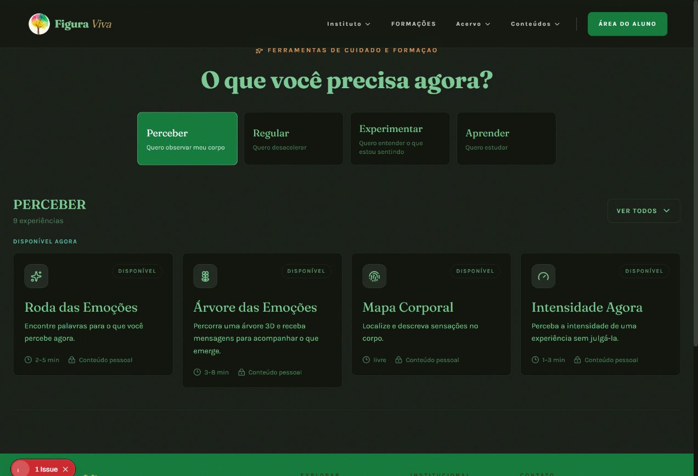

A Árvore e o Lago oferecem cenas com personalidade. Figura e Fundo usa uma composição de formas, aquarela, linha e folhagem que combina com o objetivo perceptivo. A seleção de um elemento alterou a hierarquia e explicou o que emergiu como figura. Essas cenas são um diferencial do produto.

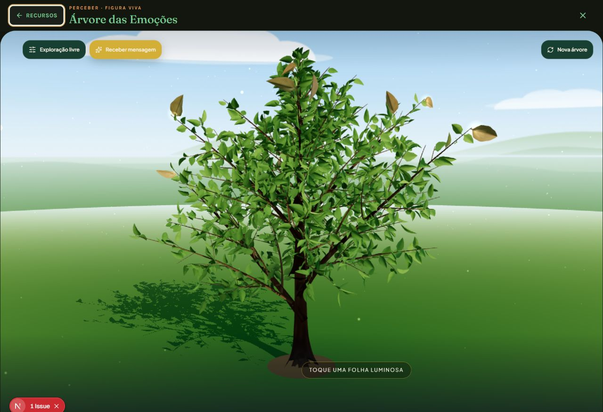

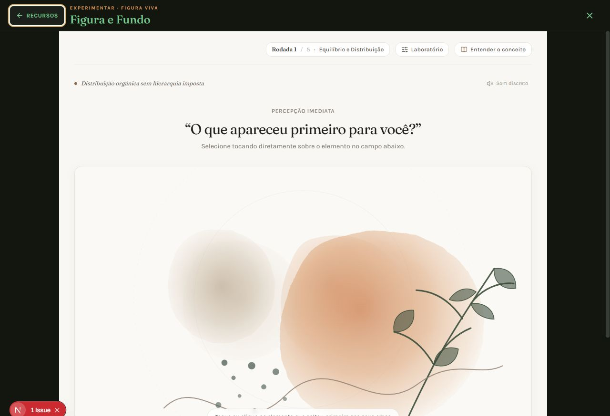

A Roda oferece uma lista linear como alternativa à representação circular. O Rio permite reduzir o movimento e apresenta o texto fora do Canvas. Sala de Pausa oferece duração livre, interrupção e alternativa estática. Mapa Corporal concluiu a seleção e moveu o foco para o resultado. Esses padrões merecem ser adotados em toda a biblioteca.

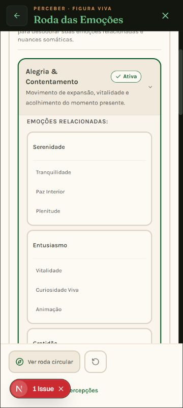

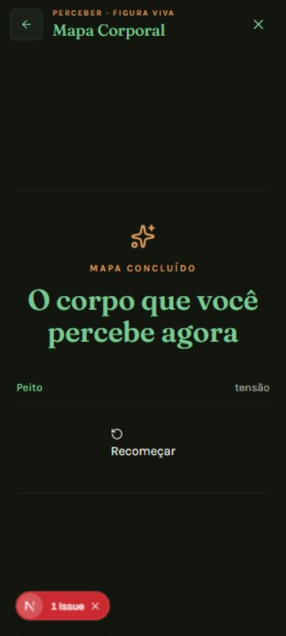

Os avisos educativos, as respostas opcionais e o vocabulário de observação sem julgamento são pontos positivos. Sons para Awareness explica seu propósito e oferece uma entrada sem áudio; o Ciclo esclarece que sua sequência é uma organização didática, sem apresentá-la como universal.

## 4. Problemas que pesam na nota

### Q01 — Pontuação incorreta no questionário autoral de ansiedade · P0

**Confirmado por jornada completa e código.** Foram dadas oito respostas fictícias “Quase sempre” em “Sinais de ansiedade”. O resultado exibiu **0% e “Baixa frequência” nos quatro domínios**.

O motor grava o texto de `answerOptions`, em português, como valor da resposta. O cálculo espera códigos como `almost_always` ou números de 1 a 5. Um texto desconhecido cai em zero. Isso afeta o caminho autoral de rastreio revisado; não há evidência de que os instrumentos PHQ-9, WHO-5, ASRS, AQ-10 e CBI, que usam outro fluxo, tenham o mesmo defeito.

**Impacto:** o resultado contradiz as respostas fornecidas e compromete a confiança na ferramenta. **Recomendação:** impedir a publicação desse cálculo até corrigir a representação dos valores; usar `{label, value}`, rejeitar valores desconhecidos e verificar o caminho inteiro entre seleção, cálculo e resultado. Todas as respostas máximas devem gerar a pontuação máxima prevista pelo questionário autoral.

Fontes: `mental-health-quiz/components/QuizEngine.tsx:114`; `data/screenings.ts:15`; `utils/scoring.ts:3` e `:16`. Reprodução completa: `2026-10-04-recursos-evidence/quiz-reproducao.txt`.

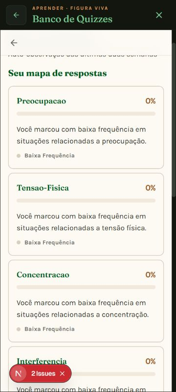

### Q02 — Avanço automático concorre com “Continuar” · P1

**Confirmado na interface e no código.** Na primeira pergunta do quiz, selecionar “Às vezes” e clicar em “Continuar” levou à pergunta 3. A seleção agenda um avanço automático; o botão agenda outro avanço. Não há trava comum que impeça as duas transições.

**Recomendação:** escolher um único padrão de avanço. Se houver botão de confirmação, selecionar deve apenas marcar a resposta. Proteger as transições contra cliques rápidos, desabilitar controles durante a mudança e impedir conclusão com perguntas não respondidas. Fonte: `QuizEngine.tsx:35–76`.

### Q03 — Diário da Roda e caderno do Jardim não abrem · P1

O botão “Ver Caderno de Notas” foi clicado no Jardim e manteve a mesma experiência. Os adaptadores passam callbacks vazios tanto para o caderno quanto para “Meu Diário de Percepções” da Roda.

**Impacto:** o usuário vê uma promessa de consultar registros sem ter um destino funcional. **Recomendação:** conectar os botões a um painel real, com estados vazio, carregamento e erro, ou retirar essas ações até que estejam disponíveis. Fontes: `EmotionWheelApp.tsx:28` e `JardimPensamentosApp.tsx:13`.

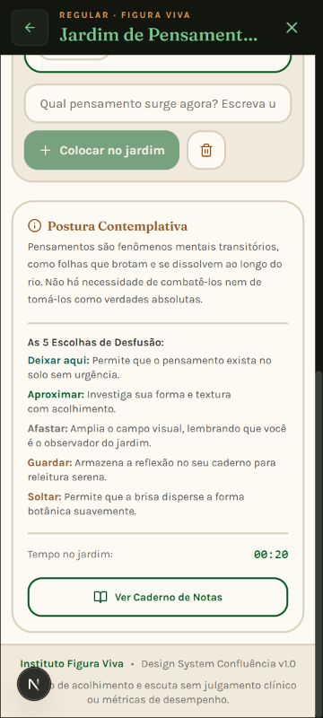

### Q04 — Mensagem de privacidade da Roda não corresponde à implementação · P1

A interface afirma que o registro é “protegido por Row Level Security no Supabase”. Nesse caminho, `SupabasePersistenceService` lê e escreve em `localStorage`; o SQL aparece como texto de esquema recomendado, sem implementar a gravação remota. O nome da classe não demonstra uso do banco.

As chaves locais incluem um usuário ativo compartilhado. O adaptador atualiza esse usuário quando há ID, mas não o limpa quando não há usuário. Isso cria risco de atribuição a uma identidade anterior no mesmo navegador; o cenário entre contas não foi executado nesta auditoria. “Privado” não deve ser tratado como sinônimo de isolamento por RLS neste fluxo.

**Recomendação:** explicar claramente onde os registros ficam, quem pode acessá-los no mesmo dispositivo e como apagá-los; implementar identificação e separação consistentes; tornar falhas de gravação visíveis. O serviço captura falhas de `setItem` com aviso no console, enquanto a Roda anuncia sucesso sem receber um resultado de gravação.

Fontes: `src/components/services/supabaseService.ts:65–90`, `:150–180`; `EmotionWheel/ExplorationPanel.tsx:297`; `RodaDasEmocoes.tsx:134–154`. Não foi alegada uma vulnerabilidade de RLS no servidor: o problema comprovado é a divergência entre a mensagem e o mecanismo deste caminho.

### Q05 — Segunda cadeira cortada no celular · P1

**Confirmado em 360 e 320 px.** Em 360 px, o palco tinha largura útil aproximada de 317 px e conteúdo de 435 px. A cadeira B se estendia de x≈290 a x≈452, além da viewport e da região visível. A experiência dispõe de outros botões de troca, mas a ilustração e o alvo direto da segunda perspectiva ficam prejudicados.

**Recomendação:** reorganizar o palco em coluna ou reduzir o conjunto com dimensões realmente responsivas; manter ambas as perspectivas identificáveis e acionáveis. Aprovação: nenhuma perspectiva, texto ou controle principal cortado em 320, 360 e 390 px.

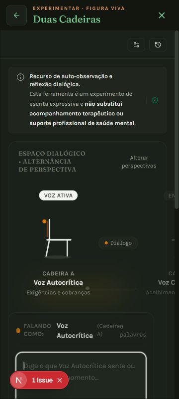

### Q06 — Frase da Árvore cortada no mobile · P1

**Confirmado após a animação terminar.** A árvore 3D carregou e a mensagem foi recebida. Na viewport de 360 px, parte do texto da folha se estende além da borda direita. A cena funciona, mas o conteúdo que dá sentido à interação fica incompleto.

**Recomendação:** separar o posicionamento central da animação do texto, limitar a largura à área útil e verificar frases curtas e longas. No componente, a figura combina centralização por `translate` com animação de `y`; é uma hipótese de causa a verificar, não uma causa comprovada nesta execução. Fonte: `emotion-tree/components/ui/LeafMessageCard.tsx:100–135`.

### Q07 — Controles do SomaScan sobrepostos ao cabeçalho · P1

Em 390 × 844, o corpo apareceu, mas os controles internos de áudio e conclusão não ficaram visíveis na área da experiência. A inspeção posicionou “Concluir” entre y≈7,6 e y≈43,6, dentro da faixa ocupada pela navegação comum do recurso. O controle é posicionado de forma absoluta no scanner, cuja integração exige corrigir o contêiner de referência.

A conclusão foi exercitada pela automação, mas isso não prova que o botão esteja fisicamente alcançável por toque. O resultado também expôs os códigos `chest` e `tension` ao usuário.

**Recomendação:** reservar espaço para os controles dentro do microapp, abaixo do cabeçalho externo; garantir toque sem sobreposição e traduzir os identificadores no resultado. Fonte: `soma-scan/components/Scanner.tsx:199–227`.

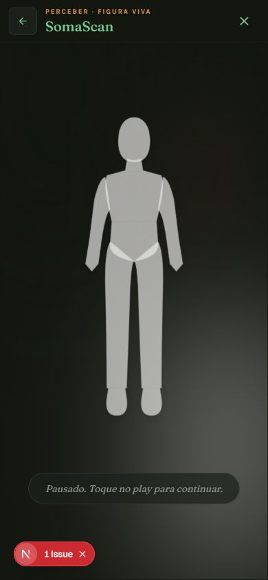

### Q08 — Contraste insuficiente e temas inconsistentes · P1

Na prática de Respiração, “Inspire” foi renderizado em `rgb(13,12,11)` sobre uma área escura; ficou difícil de ler. O Caso Clínico combina cartões escuros com textos igualmente escuros na configuração encontrada. Esses problemas persistiram em capturas estáveis, sem tela de carregamento.

**Recomendação:** usar pares de tokens de texto/superfície em todos os componentes, incluindo SVG, gradientes e estados ativo/desabilitado. Medir contraste sobre o fundo efetivo. A [WCAG 2.2](https://www.w3.org/TR/WCAG22/#contrast-minimum) exige 4,5:1 para texto comum e 3:1 para texto grande, com exceções previstas no próprio critério. Não foi calculado um índice de conformidade para a página inteira.

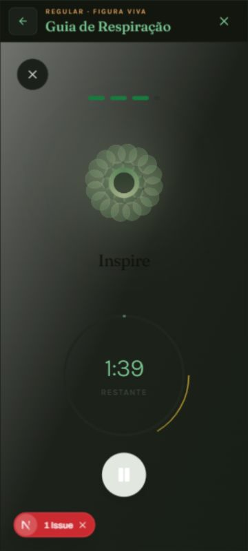

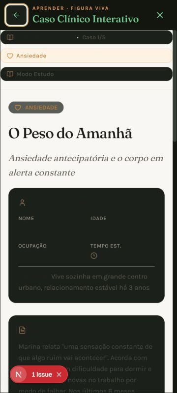

### Q09 — Check-in contradiz a promessa de resposta opcional · P1

O texto diz “Você pode simplesmente continuar”, mas “Avançar para o corpo” estava desabilitado com os campos vazios. Não foi encontrada uma ação de pular nessa tela. O código vincula o botão a `hasContent`.

Todos os prompts usam `autoFocus`; na abertura observada, o último campo recebeu foco e a rolagem deixou o título/instruções fora da tela. Em um aparelho físico, também é necessário testar o impacto do teclado virtual.

**Recomendação:** permitir avanço vazio conforme a instrução, oferecer uma opção explícita de pular e manter o foco inicial no título. Fontes: `check-in/components/ArrivalStep.tsx:104`; `PromptDisplay.tsx:26`. O hook grava o estado local automaticamente: revisar também se isso está explicado antes de começar a escrever.

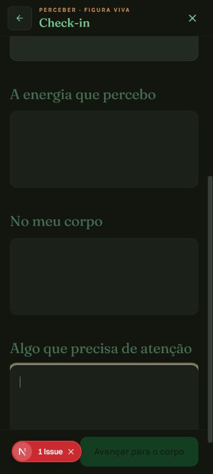

### Q10 — Botões sem nome acessível no mobile · P1

A árvore de acessibilidade apresentou um botão de reinício da Roda sem nome quando seu texto é ocultado no mobile; o botão interno de saída da Respiração também apareceu sem nome. No Lago, quatro botões de modo perderam o nome na representação acessível em 360 px. Há texto no DOM nesses botões, mas ele não foi exposto como nome no estado observado.

**Recomendação:** usar `aria-label` estável nas ações que ficam apenas como ícone, além de estados selecionados apropriados e foco visível. O critério [Name, Role, Value](https://www.w3.org/TR/WCAG22/#name-role-value) fornece a referência. O Lago teve controles de modo de cerca de 38 × 30 px: isso é menor que a meta de conforto adotada de 44 × 44, mas não comprova por si só uma falha no mínimo de 24 px da [WCAG 2.2](https://www.w3.org/WAI/WCAG22/Understanding/target-size-minimum.html).

### Q11 — Hidratação com erros nas rotas de recursos · P1

O console registrou repetidamente divergência entre HTML do servidor e cliente ao abrir as rotas de recursos. As mensagens apontam a inserção do diálogo de `Modal` no cliente; o componente retorna `null` no servidor e cria um portal no cliente.

**Impacto observado:** recuperação de renderização e instabilidade na abertura. As telas terminaram carregando; os avisos vermelhos nas imagens são ferramentas do ambiente de desenvolvimento, e não parte da interface de produção. **Recomendação:** tornar a primeira renderização consistente e conferir acesso direto e navegação pelo catálogo também em build de produção. Evidência: `console-errors.json`; referência de código: `src/components/ui/Modal.tsx:106`.

### Q12 — Descoberta, conteúdo e acabamento ainda desiguais · P2

- O catálogo chama o quiz de “Perguntas e estudos para formação”, mas a tela abre questionários de saúde mental e autoconhecimento. O destino precisa estar claro antes do clique.
- Links “Ver todos →” dentro do Banco de Quizzes apontam para `#`, sem implementar a promessa de expansão.
- Jardim inicia com duas frases de demonstração sem identificá-las claramente como exemplos e exibe o nome/versão do design system no rodapé. Remover a informação técnica da experiência e marcar conteúdos de exemplo.
- Muitos recursos não têm duração no catálogo, embora o tempo ajude quem busca uma pausa curta. Os totais das categorias incluem itens em preparação; distinguir disponíveis e futuros.
- A Roda é visualmente rica, mas densa e pequena em 360 px; a lista melhora a leitura. Oferecer seleção por família antes de mostrar todas as nuances no celular.
- Em Fronteiras, os rótulos “Alta tensão”, “Média tensão” e “Baixa tensão” já aparecem nas opções antes da escolha. Isso orienta a resposta e reduz a exploração aberta; explicar melhor se a intenção é uma simulação didática ou uma investigação sem resposta ideal.
- No Caso Clínico, “Baseada em Evidência” é uma promessa editorial que requer referências verificáveis. A mistura de abordagens deve ser apresentada explicitamente. A auditoria não validou clinicamente o conteúdo.

## 5. Inventário e saúde das etapas observadas

As avaliações abaixo descrevem o que foi observado. “Boa abertura” não significa validação de toda a funcionalidade ou do conteúdo clínico.

| Etapa | Recurso / ação | Saúde observada e limite |
| ---: | --- | --- |
| 1 | Catálogo: filtrar, expandir e abrir | Boa. Filtros e expansão funcionaram; existem 24 disponíveis e 10 futuros. |
| 2 | Roda: selecionar família e trocar para lista | Parcial. Seleção e lista funcionam; diário desconectado, texto de privacidade incorreto e reinício sem nome no mobile. |
| 3 | Árvore: carregar cena e receber mensagem | Parcial. Cena expressiva e mensagem disponível; frase cortada em 360 px. |
| 4 | Mapa Corporal: marcar tensão no peito e concluir | Boa na jornada testada. Resultado corresponde à marcação, com foco na conclusão. Ilustração simples. |
| 5 | Intensidade: controle por teclado e encerramento | Boa na amostra. Controle range nativo e conclusão disponíveis; pouca síntese final. Não há validação de todas as entradas. |
| 6 | Diário do Aqui e Agora: abertura | Parcial. Perguntas e sugestões claras; indicador de cinco momentos fica comprimido no mobile. Fluxo completo de gravação não testado. |
| 7 | SomaScan: iniciar, marcar e concluir | Parcial. Corpo e seleção funcionam; controles sobrepostos e códigos em inglês no resumo. Áudio não escutado. |
| 8 | Necessidades Agora: iniciar biblioteca | Boa abertura. Limite de cinco, opção livre e “Ainda não sei”; consentimento claro. Histórico autenticado não testado. |
| 9 | Check-in: abrir sem preencher | Problemática. Avanço bloqueado apesar da instrução opcional e foco inicial deslocado. |
| 10 | Sons para Awareness: abertura | Boa abertura. Orientação, volume confortável e alternativa sem áudio. Qualidade acústica e canais não escutados/testados. |
| 11 | Respiração: escolher, iniciar e pausar | Parcial. Timer e pausa respondem; instrução principal perde contraste e saída interna fica sem nome. Final automático não aguardado. |
| 12 | Grounding 5-4-3-2-1: abertura | Boa abertura. Ritmo livre, marcas por percepção e instruções concretas. Cinco etapas completas não percorridas. |
| 13 | Lago: carregar e acalmar ondas | Parcial. Cena carregada e controle respondeu; nomes ausentes nos modos mobile. Tempo de carga em desenvolvimento não é benchmark. |
| 14 | Rio: inserir frase fictícia, reduzir movimento e encerrar | Boa na amostra. Alternativa textual, encerramento e escolha de guardar nota separados. Persistência autenticada não validada. |
| 15 | Jardim: criar frase fictícia e abrir caderno | Parcial. Criação e seleção funcionam; caderno sem ação e exemplos iniciais pouco identificados. |
| 16 | Sala de Pausa: escolher respirar e começar | Boa na amostra. Tempo, troca, encerramento e alternativa estática disponíveis. Jornada completa e áudio não testados. |
| 17 | Figura e Fundo: contemplar e selecionar figura | Boa na amostra. Composição coerente, mudança de proeminência e explicação. Cinco rodadas completas não percorridas. |
| 18 | Polaridades: abertura | Boa abertura. Dois polos editáveis, controle nativo e reflexão. Exploração simples; conclusão e persistência não avaliadas. |
| 19 | Duas Cadeiras: palco em 360 e 320 px | Problemática no mobile. Segunda perspectiva cortada; diálogo, salvamento e retomada não percorridos integralmente. |
| 20 | Banco de Quizzes: pergunta e rastreio completo | Problemática. Pontuação autoral incorreta, avanço concorrente e links sem expansão. Instrumentos validados usam outro caminho e não foram completados. |
| 21 | Banco de Microcasos: abertura | Boa abertura. Três casos, temas, níveis e busca. Catálogo curto; percurso e histórico não concluídos. |
| 22 | Cartas Gestálticas: abertura | Boa abertura. Explorar, revisão, aleatório, favoritos e histórico organizados; armazenamento local explicado. Caminhos internos não concluídos. |
| 23 | Ciclo do Contato: início do percurso guiado | Boa na amostra. Aviso pedagógico, etapa e aprofundamento claros. Seis etapas e aplicação não concluídas. |
| 24 | Fronteiras de Contato: abertura | Parcial. Situação e alternativas têm conteúdo; revisar contraste, direcionamento prévio e coerência editorial. Diário não testado. |
| 25 | Caso Clínico Interativo: abertura | Parcial. Casos fictícios e navegação identificados; leitura comprometida no tema observado. Reflexão e conteúdo clínico não validados. |

## 6. Preparação para mobile

**Resposta direta: parcialmente preparados.** A infraestrutura tem tela cheia com `100dvh`, rolagem interna, navegação comum e botões de fechamento. Vários fluxos reorganizam bem seus campos. Isso é uma base boa, mas responsividade não se resume a caber dentro de uma janela.

Os cortes de Duas Cadeiras e da frase da Árvore afetam elementos essenciais. O SomaScan posiciona controles sob o cabeçalho. O check-in altera a posição inicial por foco automático. A Roda exige muita rolagem e leitura de rótulos pequenos. Essas falhas impedem uma aprovação geral para celular.

Para aprovação: conferir 320, 360, 390 e 430 px; retrato e paisagem; textos maiores; teclado virtual; aparelhos Android de entrada e Safari/iOS; toque em todos os controles; foco e retorno; mensagem longa; armazenamento indisponível; rede lenta; movimento reduzido; WebGL indisponível. A referência de [reflow da WCAG](https://www.w3.org/WAI/WCAG22/Understanding/reflow.html) usa largura equivalente a 320 CSS px para conteúdo vertical, com exceções para elementos que realmente exigem duas dimensões. Mesmo nessas exceções, o usuário precisa de acesso ao conteúdo e às ações.

## 7. Ordem recomendada de correção

| Prioridade | Trabalho | Critério de aceite |
| --- | --- | --- |
| P0 — antes de publicar o rastreio autoral | Corrigir valores das respostas e cálculo | Oito respostas máximas produzem pontuação máxima; inválidos não viram zero silenciosamente. Resultado revisado por responsável editorial. |
| P1 — confiabilidade | Unificar avanço do quiz e bloquear transições duplicadas | Um clique equivale a um avanço; nenhuma questão é pulada; conclusão exige respostas previstas. |
| P1 — confiança | Conectar diários/caderno e corrigir mensagem de persistência | Consulta funciona; informação sobre dispositivo/conta é verdadeira; erros não anunciam sucesso. |
| P1 — celular | Ajustar cadeiras, mensagem da Árvore e controles de SomaScan | Todas as informações e ações principais permanecem visíveis e acionáveis nas larguras verificadas. |
| P1 — leitura e acesso | Corrigir pares de cor e nomes acessíveis | Contrastes medidos; controles mobile com nomes estáveis; teclado e foco verificados. |
| P1 — navegação | Corrigir opcionalidade/foco do check-in e hidratação do modal | Continuar vazio funciona; instrução visível na entrada; rotas abrem sem divergência de hidratação em produção. |
| P2 — acabamento | Unificar durações, vocabulário, títulos, exemplos e avisos | Cada card corresponde ao destino; nenhum link promete ação inexistente; termos técnicos internos ficam fora do fluxo. |
| P2 — validação | Completar jornadas restantes e testar dispositivos reais | Matriz por recurso com entrada, interação, conclusão, retomada, erro e privacidade, incluindo evidência de aparelho físico. |

**Parecer final:** a coleção já tem valor e bons diferenciais visuais, mas ainda não apresenta um padrão homogêneo de qualidade profissional. Priorizar a correção do resultado autoral e das integrações; depois resolver legibilidade e cortes no celular. Só então uma nova auditoria pode justificar uma nota de maturidade mais alta.

## 8. Evidências e rastreabilidade

As imagens incluídas neste relatório foram capturadas e inspecionadas nesta execução. Capturas iniciais com carregamento ou animação incompleta foram descartadas como prova de defeito; as imagens da árvore, do Lago, do quiz e do Caso foram recapturadas após carregamento/estabilização quando usadas nos achados. Os arquivos auxiliares da pasta podem incluir essas capturas intermediárias; o conjunto aceito é o referenciado no relatório.

Arquivos de apoio: `catalog-links.json` (24 rotas observadas), `quiz-reproducao.txt` (oito perguntas e resultado), `console-errors.json` (erros de hidratação), snapshots de abertura e imagens em `2026-10-04-recursos-evidence/`.

As referências de código são relativas à raiz do projeto e descrevem o estado local revisado. Nenhuma mudança funcional foi feita pela auditoria. Recomendações são ações futuras; não foram implementadas neste trabalho.
